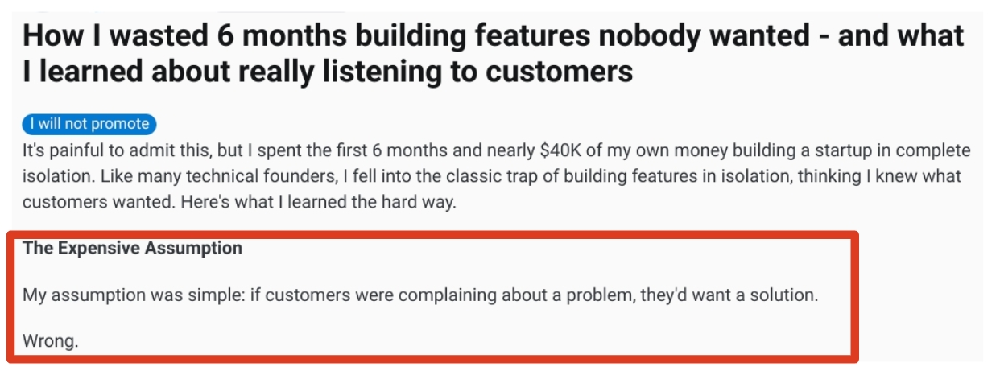
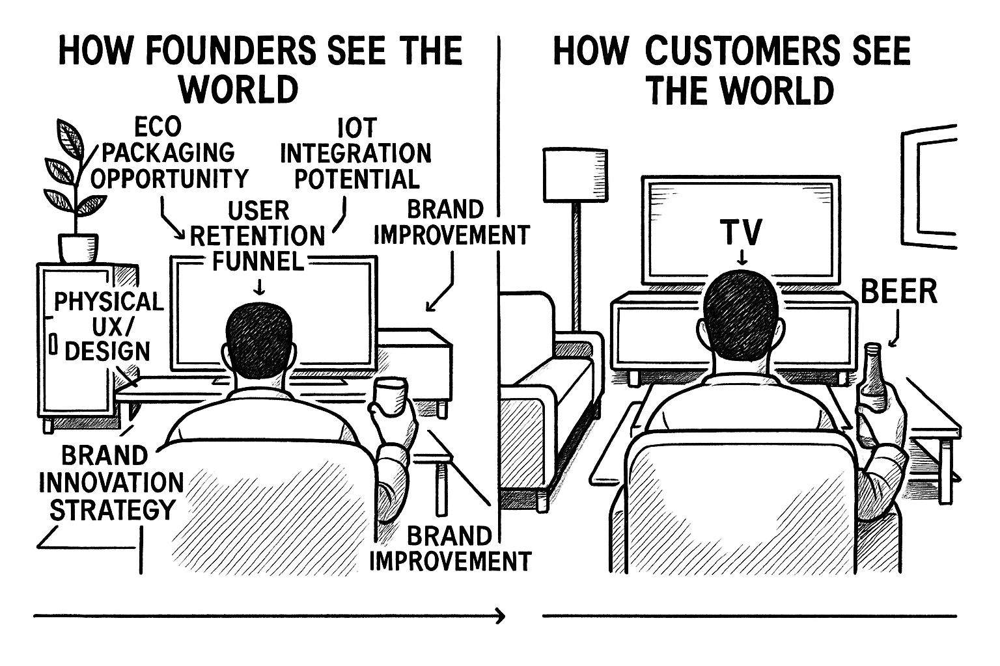
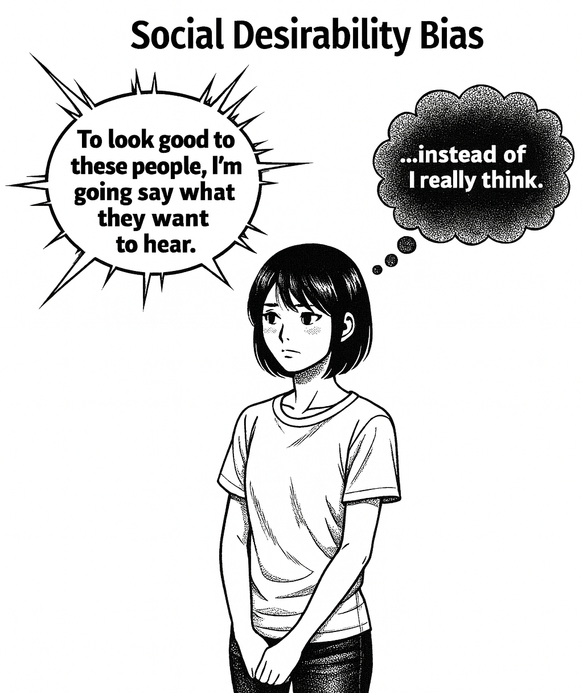
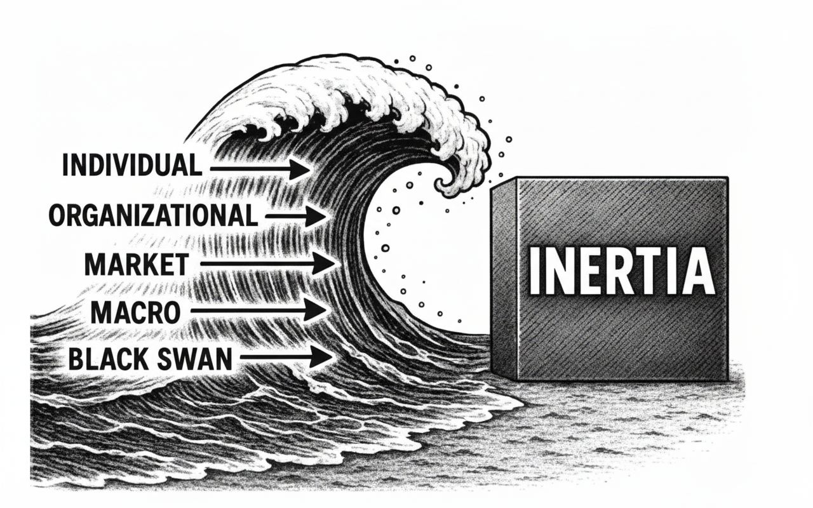
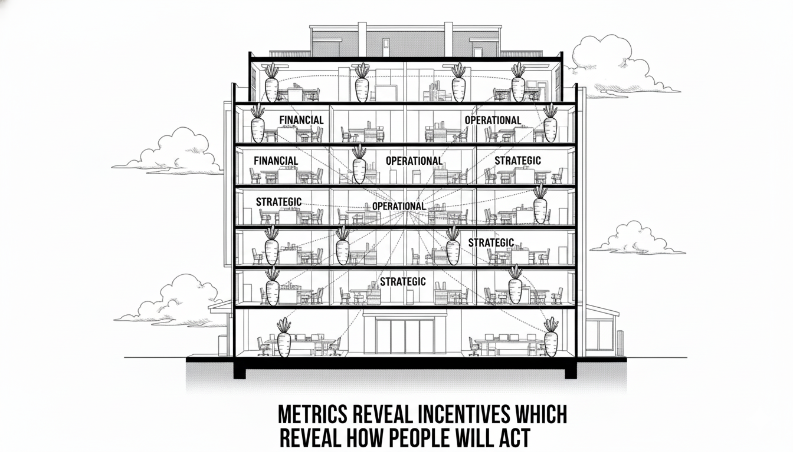
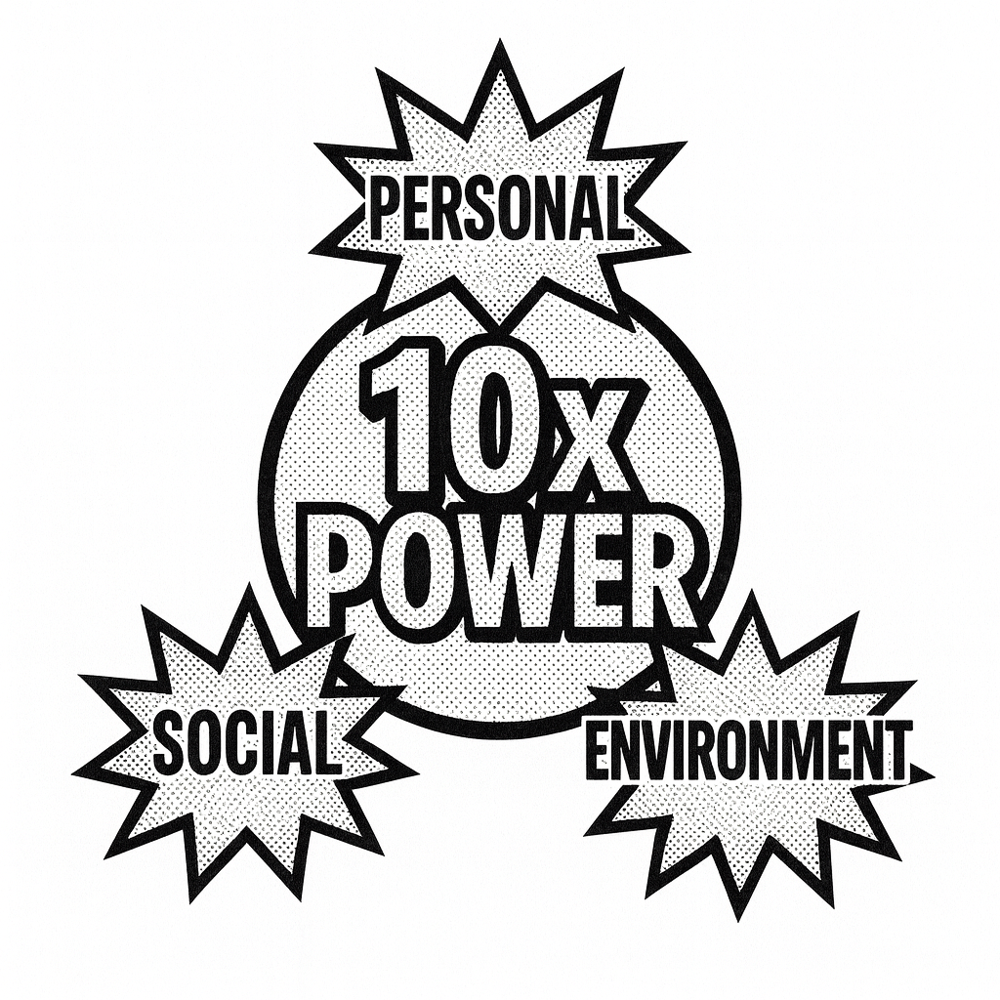

# The Physics of Product Market Fit

This guide synthesizes insights from advising thousands of startups and offers principles and frameworks for any founder who has ever been in (or wants to avoid) the painful situation in which this Redditor found themselves in:

### Goals for This Guide

Give you tools, frameworks and mental models to:

* Avoid company death.
* Get customers to enthusiastically pay you for your product.
* Have foundational metrics to raise VC (if that’s your goal and you meet other VC criteria).

**Lack of** [**product-market fit**](https://www.google.com/url?q=https://pmarchive.com/guide_to_startups_part4.html\&sa=D\&source=editors\&ust=1761262015311437\&usg=AOvVaw3tizMCQD1IM42wsORizk4k) **kills more startups than any other factor**. This guide addresses a specific failure mode: startups that receive positive customer feedback but fail to achieve meaningful adoption or traction (usage or revenue).

Borrowing from **neuroscience, behavioral economics, and human dynamics,** the framework below explains **why customers say they love your product but don't use it — and what to do about it**.

### So Why Does This Happen?

You’ve spoken with customers and listened to their frustrations and complaints. You’ve shown them your product and they seem enthusiastic about it and said “yes” to the question: “would you use this?”. And yet, you hear crickets when it comes to actual adoption and traction.

The problem isn't necessarily your product. The problem is physics and is rooted in the innovator’s blindspot.

### The Innovator’s Blindspot

The way you see the world is both an incredible advantage as well as the source of a blindspot: your customers are not like you.

As a founder you embrace change, [generate infinite ideas](https://www.google.com/url?q=https://www.instagram.com/reel/DPgTraYFbDa/\&sa=D\&source=editors\&ust=1761262015314151\&usg=AOvVaw2QGUzDqOXbHXBN0ZTSIiJB), and see opportunity everywhere. Most humans (i.e., your customers), however, are optimized for something entirely different: survival through conservation of energy. They want to make it through their last Zoom meeting, grab a glass of wine, and zone out to Netflix.

This isn't laziness. This is biology.

So how can you overcome this barrier?

Physics.

The following Laws of The Physics of Product Market Fit are offered as principles — not dogma — which may prove useful to you on your journey toward achieving PMF.&#x20;

Experiment with them, make them your own.&#x20;

<mark style="background-color:yellow;">**And please send**</mark> [<mark style="background-color:yellow;">**feedback**</mark>](https://forms.gle/YpfzMKBTSTjisAz97) <mark style="background-color:yellow;">**as you do.**</mark>&#x20;

### Law #1: The Law of Inertia

_**Principle**: A human being defaults to the status quo unless acted upon by a force._

* Human biology optimizes for energy conservation. This manifests as status quo bias: the demonstrated preference for maintaining current conditions over adopting new ones, even when the new option is objectively superior.
* Neuroscience confirms this isn't laziness but [evolutionary optimization](https://www.google.com/url?q=https://www.sciencedaily.com/releases/2018/09/180918090849.htm\&sa=D\&source=editors\&ust=1761262015316717\&usg=AOvVaw3_dlJUozK_IV946lOoinWw). Our cognitive systems prioritize efficient energy use for survival-critical functions: safety assessment, resource acquisition, and social bonding.
* The linguist [George Zipf](https://www.google.com/url?q=https://www.thoughtco.com/principle-of-least-effort-zipfs-law-1691104\&sa=D\&source=editors\&ust=1761262015317237\&usg=AOvVaw2tidcnaTNeLe7b5zLYMVL2) studied the [Law of Least Effort](https://www.google.com/url?q=https://en.wikipedia.org/wiki/Principle_of_least_effort%23:~:text%3DThe%2520principle%2520of%2520least%2520effort,least%2520resistance%2520or%2520%2522effort%2522.\&sa=D\&source=editors\&ust=1761262015317476\&usg=AOvVaw21QOlwcJQpcynNz2PgiRA9) and related it to language patterns and human preferences.

**Implication**: Your primary competition is not other products. It is your customer's current workflow and their biological resistance to and fear of change.

_<mark style="background-color:yellow;">**Change introduces uncertainty. Uncertainty triggers threat responses**</mark>. These responses are stronger than the perceived benefits of improvement, particularly when those benefits are theoretical rather than immediate._

**Takeaway**: Unless your product overcomes this inertia through external forcing functions or dramatically superior outcomes (see 10x power below), adoption will be a challenge regardless of product quality and no matter how painful their current situation may be.

### Law #2: The Law of Behavior

_**Principle**: Human behavior is more reliable than human opinion._

* Research in cognitive neuroscience (Gazzaniga et al. [split brain research](https://web.archive.org/web/20150728204838/http://www.theatlantic.com/health/archive/2015/07/split-brain-research-sperry-gazzaniga/399290/)) identifies specialized [regions](https://www.google.com/url?q=https://fs.blog/michael-gazzaniga-the-interpreter/\&sa=D\&source=editors\&ust=1761262015320023\&usg=AOvVaw2dAsxoW3pgsHwT0k83kAgu) called “the interpreter” in the left hemisphere that construct post-hoc narratives about our decisions and preferences. These narratives serve social and psychological functions but are not always accurate representations of our actual motivations or intentions.
* If you review survey data against actual observed or behaviorally monitored data you will usually see a [massive gap](https://www.google.com/url?q=https://www.bbc.com/audio/play/m001w7ny\&sa=D\&source=editors\&ust=1761262015320879\&usg=AOvVaw0Qh6Vr2ZbYw39xwp-UY0oe).

This manifests in two ways for startup founders:



#### Social desirability bias

Interview subjects provide responses they believe are helpful or socially acceptable rather than truthful.



#### Intention-action gap

Stated intentions do not predict actual behavior. People often rely on their brain’s interpreter’s reasons for why they do or do not do certain actions, and these reasons may not be rooted in truth.



**Implication**: Customer development based on interviews and surveys generates systematically unreliable data. Positive feedback, especially, is impacted by the social desirability bias which can negatively impact the quality of information gained.

_Watch behavior instead, especially the behavior after you have spoken with customers and shown your product._

<mark style="background-color:yellow;">**Behavioral signals that matter**</mark>:

* Unprompted requests for pricing or contract terms.
* Introduction to decision-makers or budget holders.
* <mark style="background-color:yellow;">**Repeated**</mark> <mark style="background-color:yellow;"></mark><mark style="background-color:yellow;">follow-up from the customer</mark> (especially in the case of an early demo).
* Time investment in integration discussions.
* Sharing your product with colleagues.
* Actions they are already taking to solve the problem, albeit badly, expensively, slowly.
* Beware of false action or innovation "curiosity" (arranging meetings for show without buy-in or intention). **Test with Law #4**.

**Takeaway**: Observe behavior. Discount opinions. If someone truly demands your product, their actions will demonstrate it _without prompting_. If you are not seeing behavioral signals like those above, continue refining and applying the principles.

### Law #3: The Law of Waves

_**Principle**: External forces (waves) affecting your customer determine whether your product is a must-have or a nice-to-have._

* <mark style="background-color:yellow;">**Waves are**</mark> <mark style="background-color:yellow;">**external forces which create the urgent need for change**</mark> in an individual or organization.
* You want to ride these waves as a founder. Charlie Munger (Warren Buffett’s former partner at Berkshire Hathaway) said it [well](https://www.google.com/url?q=https://fs.blog/ride-wave/\&sa=D\&source=editors\&ust=1761262015325761\&usg=AOvVaw2C0eAbyi8a1L9aRyD9mtfd).
* The good news is that you don’t have to create market waves (a painful, disheartening, time consuming and expensive process). Rather, you can detect and leverage existing waves.
* Waves are the answer to the VC question: Why now? Or in other words: why is [timing](https://www.google.com/url?q=https://www.tandfonline.com/doi/full/10.1080/08956308.2022.2072626%23:~:text%3DHe%2520considered%2520100%2520companies%2520that,success%2520or%2520failure%2520was%2520timing.\&sa=D\&source=editors\&ust=1761262015326613\&usg=AOvVaw0VVJR8HtlJnQzQu_QYBts2) on your side? And waves disrupt the status quo.
* Often, the focus will be on forces / waves which have influenced change over the past 18 months, likely influenced by [Moore’s Law](https://www.google.com/url?q=https://runestone.academy/ns/books/published/welcomecs/ParallelProcessing/MooresLaw.html\&sa=D\&source=editors\&ust=1761262015327158\&usg=AOvVaw1s4Kwy8EnE_Ye7DERlCGr8).

**Implication**: Great products and companies are not the sole result of willpower and pushing something onto the market, backed by massive marketing and sales dollars. They are also a result of noticing the forces that are already at play and aligning with and riding them to success.

_<mark style="background-color:yellow;">**Startups are more like the art of surfing versus swimming**</mark>_.

**How do you identify waves? Waves come in local as well as global forms. Here’s a taxonomy:**

**Individual-level Waves (BtoC)**

* Physiological: Health, energy, biological capacity changes
* Resource: Income, time, attention availability shifts
* Social-norm: Behavioral expectation changes in peer groups
* Cognitive: New information processing capabilities
* Capability: Skill acquisition or loss
* Legal status: Regulatory changes affecting individuals

_Example: A health scare encourages someone to take action on their wellbeing._

**Organizational Waves**

* Governance: Leadership or decision-making structure changes
* Information exposure: New data availability or transparency requirements
* Talent flow: Hiring/retention disruptions
* Capital structure: Funding availability changes
* Operational capacity: Infrastructure or process failures

_Example: An industry-wide AI hiring spree makes it impossible to find the right talent for a small company._

**Market Waves**

* Demand shifts: Customer need spikes or collapses
* Competitive dynamics: New entrants or incumbent failures
* Supply disruptions: Input availability or cost changes
* Regulatory changes: Compliance requirement shifts
* Reputation events: Trust or brand perception changes
* Enabling infrastructure and tech: Ubiquitous access to faster, better or cheaper tools

_Example: Consumers around the world are drinking less alcohol, creating a massive strain on the industry._

**Macro Waves**

* Policy: Government action or inaction
* Monetary: Interest rate or currency changes
* Geophysical: Natural disasters or climate impacts
* Security: Conflict, terrorism, or crime changes
* Energy: Power availability or cost shifts

_Example: Tariff uncertainties and effects have wiped out many business models overnight._

**Black Swan Waves**

* Systemic catastrophes: Pandemics, financial collapses, infrastructure failures

_Example: Droughts and wildfires impacting home construction materials and locations._

**Takeaway**: Use these wave categories to guide your customer interviews to identify which ones will make the status quo unsustainable. If no wave exists, you may end up in the perennial “thinking about, testing, pilots and meetings” zone.

The strongest products answer "Why now?" with a specific, verifiable external wave that occurred in the past 18 months.

**Bonus**: Stack waves to identify a [lollapalooza effect](https://www.google.com/url?q=https://www.youtube.com/watch?v%3DorqFOGPTQ0w\&sa=D\&source=editors\&ust=1761262015334860\&usg=AOvVaw1ZaFtUgKgw90Dr-2zxKQwy) supporting your product adoption.

**Case Study: WhatsApp**

| Wave                         | Effect                                    |
| ---------------------------- | ----------------------------------------- |
| International SMS Cost       | Replace with free global texting via data |
| Mobile Data Plans Price Drop | Ubiquitous, affordable access             |
| End-to-End Encryption        | User trust, privacy default               |
| Diaspora Demand              | Cross-border family/immigrant use         |

**Case Study: Figma**

| Wave                     | Effect                                   |
| ------------------------ | ---------------------------------------- |
| WebGL/Browsers Mature    | Real-time, browser-based design possible |
| Remote Work Boom (COVID) | Collab design tools essential            |
| SaaS Tool Fragmentation  | Unified design/docs demand               |
| Google Docs UX Ubiquity  | Translating to design tools              |

**Case Study: Uber**

| Wave                    | Effect                                              |
| ----------------------- | --------------------------------------------------- |
| 2008 Financial Crisis   | Surplus of gig labor, high urban unemployment       |
| App Store Launch (2008) | Instant mobile distribution for location-based apps |
| Mobile GPS Ubiquity     | Accurate real-time driver/rider matching            |
| 4G Data Rollout         | Low-latency maps and tracking at scale              |
| Taxi Regulation Inertia | Poor user experience, regulatory arbitrage          |
| Peer Ratings Trust      | P2P trust systems normalized                        |
| Social Status           | “Black limo” for everyday transportation            |

### Law #4: The Law of Incentives

_**Principle**: Product-market fit probability increases with connection strength to operational, financial, or strategic metrics._

* While traditional startup metrics like CAC, LTV etc remain important, keep your eye on the ball when it comes to what matters to your customers.
* Align your product with the metrics that matter internally to your customers. Whether you are taking a top down or bottom up approach to sales, connecting to what gets measured is a supporting force to adoption.

**Implication**: Mapping and understanding incentives is like revealing a hidden answer key to how and why people will act and make decisions. Aligning your company and product with the incentives of a company positions you as an ally to your customer to reach success in their metrics.

_As Munger says: “<mark style="background-color:yellow;">**Show me the incentive, and I’ll show you the outcome**</mark>.”_

**Decision-maker metric priorities:**

| Metric Category            | Mechanism                                                                           |
| -------------------------- | ----------------------------------------------------------------------------------- |
| Cash flow velocity         | Accelerate revenues, optimize payment speed                                         |
| Cost efficiency            | Reduce inefficiencies and unnecessary expenses                                      |
| Capital allocation ROI     | Higher and faster returns on capital deployed / investments made                    |
| Productivity per employee  | Optimize the power of employees to create desired outcomes                          |
| Inventory turnover         | Reduce the amount of time cash is tied up in inventory on shelves, sell faster      |
| Pricing power              | Ability to charge more without losing customers (or perhaps gaining)                |
| Risk/compliance management | Avoid fines and severe government and legal penalties                               |
| Market demand dynamics     | Accelerate how quickly new products and ideas get to market to respond to customers |
| Cost of capital            | Find sources of money at lower rates and optimize returns                           |
| Competitive positioning    | Grow market share, re-enforce moats                                                 |
| Regulatory adaptation      | Anticipate and move quickly on new laws and regulations                             |
| Supplier/customer terms    | Negotiate better prices, payment terms                                              |

**Diagnostic questions**:

* Which metrics does your customer's CEO review with their board?
* Who is the person who will write the check to you for the product? What metrics are they tracking?
* Which metrics is your primary contact responsible for?
* How are these metrics currently measured?
* What is the financial value of a 10% improvement?

**Takeaway**: If your product doesn't measurably impact a C-suite metric, you are selling to the wrong person or solving the wrong problem. If stuck: look up and down the value chain. And if your client contact is not connected to these metrics, they may not have the influence and authority you need to get you across the finish line.

### Law #5: The Law of Power

_**Principle**: All great inventions and innovations in history always offer power to the customer. Power is defined as the capacity to achieve desired outcomes with less resistance._ [_10x power_](https://www.google.com/url?q=https://bothsidesofthetable.com/your-product-needs-to-be-10x-better-than-the-competition-to-win-here-s-why-6168bab60de7\&sa=D\&source=editors\&ust=1761262015357744\&usg=AOvVaw3aPp3N5aFIKxD7i8yp182r) _overcomes customer inertia in these categories:_

* **Personal**
  * **Biological Power**: Energy from food, oxygen, and cellular processes to sustain life.
  * **Cognitive Power**: The ability to process information, predict outcomes, and make decisions that enhance survival.
  * **Emotional Power**: The ability to choose our states away from pain and fear, and toward joy, pleasure and fulfillment.
* **Social**: Influence over others to secure resources, protection and cooperation.
* **Environmental**: Control over surroundings: tools, shelter, fire to extend autonomy over nature.

**Implication**: Offering power to your customer is the ultimate value proposition. Keep in mind the [Jobs to Be Done](https://www.google.com/url?q=https://www.christenseninstitute.org/theory/jobs-to-be-done/\&sa=D\&source=editors\&ust=1761262015359981\&usg=AOvVaw1AnUsCz8klrqYvde93Vs9I) framework and note that successful products often stack different types of power.

**Historical examples**:

| Innovation               | Baseline                 | 10x Improvement     | Power Category         |
| ------------------------ | ------------------------ | ------------------- | ---------------------- |
| Email                    | Postal mail (days)       | Instant delivery    | Cognitive + Social     |
| Search engines           | Library research (hours) | Results in seconds  | Cognitive              |
| On-demand transportation | 20-minute wait           | 2-minute arrival    | Environmental + Social |
| LLMs                     | 100 Open Google Tabs     | 10 second synthesis | Cognitive              |

**Diagnostic test**: Can you articulate a specific dimension where your product delivers 10x improvement over the status quo? If not, you have an incremental and not a transformative product.

**Takeaway**: Products offering order-of-magnitude power increases require minimal external forcing for adoption. Products offering incremental improvements require external wave forces. If your product feels stuck: ask how can you 10x the power you offer your customers?

### Bonus Law: Remember The Innovator’s Blindspot

_It’s worth repeating what was mentioned up top: Founders are statistical outliers. You have systematically lower status quo bias, higher risk tolerance, and greater comfort with uncertainty than your customers_.

* This creates a cognitive distortion: it’s easier to assume that because something is objectively superior, rational actors will adopt it. They will not.
* Most people optimize for minimizing decision-making effort and avoiding negative outcomes (this is especially true when looking at incentive structures inside companies) rather than maximizing positive ones. You optimize for the opposite.

**How To Mitigate The Innovator’s Blindspot**: When conducting customer research, explicitly model your customer's risk aversion, energy conservation priorities, and change resistance. Do not project your own decision-making framework onto them. When in doubt ask: **WHOSE** problem are you solving? How do **THEY** quantify the problem?

### Diagnostic Framework

Use these principles as a checklist for evaluating product-market fit:

* **Inertia (Law #1)**: Have you switched your mindset to see the customer’s inertia of switching from the status quo to your product: including financial, temporal, cognitive, social costs?
* **Behavior (Law #2)**: Are you measuring actual usage patterns and conversion behaviors, or relying on stated preferences and interview feedback?
* **Waves (Law #3)**: What specific external wave(s) in the past 18 months has made your solution urgent rather than optional? Can you name it / them precisely? Are there stacked waves you can identify?
* **Incentives (Law #4)**: Does your product measurably impact a metric that your customer's executive team reviews? Are you speaking with people who own these metrics?
* **10x Power (Law #5)**: In which dimension does your product deliver order-of-magnitude improvement? Can you demonstrate this quantitatively?
* **The Innovator’s Blindspot (Bonus)**: Have you observed your customers' actual workflows, or are you inferring their needs from your own perspective?

### Implementing The Laws

Product-market fit is not only about building something people like. It’s about understanding the behavioral and cognitive forces that govern adoption, then aligning your product with these forces rather than fighting them.

Most founders fail because they trust stated preferences over revealed preferences, underestimate status quo bias, and project their own low-inertia decision-making onto high-inertia customers.

To increase your chances of success:



### Identify the wave of the external forcing function

Find the specific external forces (waves) that make the status quo unsustainable for your target customer.



### Connect to measured metrics and executive priorities

Align your product to the metrics that matter to the decision-makers who control budget and adoption.



### Deliver 10x power order-of-magnitude improvement

Make your product deliver a clear, demonstrable, large improvement versus the status quo or stack waves to compensate for incremental gains.



### Watch behavior as the only reliable signal

Measure revealed preferences and behavioral signals (not just interview responses) to validate demand.



### Meet people where they are

Reduce friction, map incentives, and integrate into existing workflows so switching costs are minimized.



And finally, everyone falls off the wave from time to time. The point is to know that you will be OK if you do and that more waves will always be available to ride.

This guide is meant to evolve with feedback. Please [reach out](https://forms.gle/YpfzMKBTSTjisAz97) and share your experiences and stories.

© 2025 [Hiroshi Wald](https://www.google.com/url?q=https://www.linkedin.com/in/hiroshiwald/\&sa=D\&source=editors\&ust=1761262015374424\&usg=AOvVaw3fOapmQrvsbIxMPzl-3rNN)
