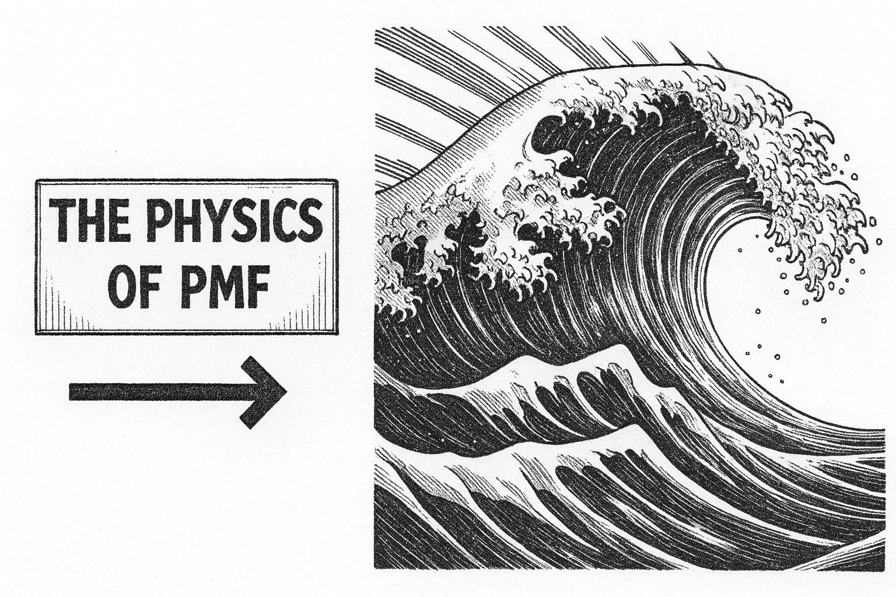
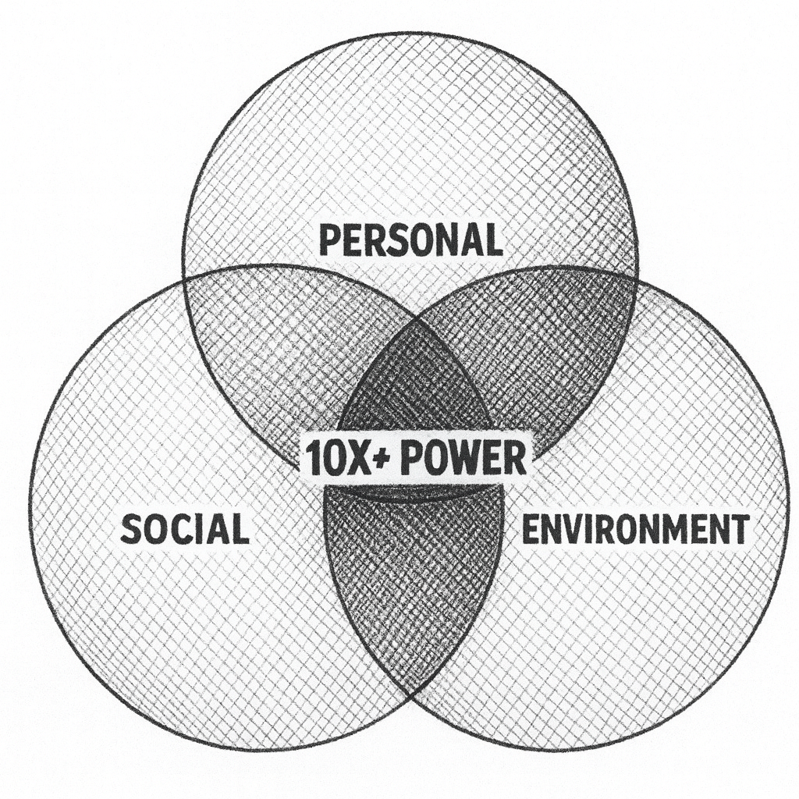
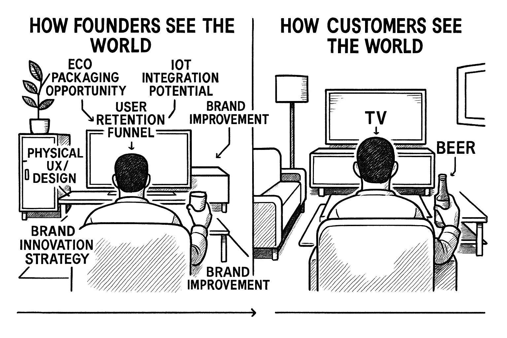

<h1 id="h.pb396ykxe8xw"></h1>
Lack of <a href="https://www.google.com/url?q=https://pmarchive.com/guide_to_startups_part4.html&amp;sa=D&amp;source=editors&amp;ust=1759451694884638&amp;usg=AOvVaw20C6qfjTfIVpkP3rVPc-FM">product-market fit</a>&nbsp;kills more startups than any other factor. This guide addresses a specific failure mode: startups that receive positive customer feedback but fail to achieve meaningful adoption or traction (usage or revenue).

The framework below synthesizes insights from advising thousands of startups and borrows from neuroscience, behavioral economics, and human dynamics to explain why customers say they love your product but don&#39;t use it.

Goals for This Guide

Give you tools, frameworks and mental models to:
<ul><li>Avoid company death.</li><li>Get customers to enthusiastically pay you for your product.</li><li>Have foundational metrics to raise VC (if that&rsquo;s your goal and you meet other VC criteria).</li></ul>
<strong>Failure Mode</strong>

You&rsquo;ve spoken with customers and listened to their frustrations, and complaints. You&rsquo;ve shown them your product and they seem enthusiastic about it and said &ldquo;yes&rdquo; to the question: &ldquo;would you use this?&rdquo;. And yet, you hear crickets when it comes to actual adoption and traction. 

The problem isn&#39;t your product. The problem is physics and is rooted in the innovator&rsquo;s blindspot. 

<strong>The Innovator&rsquo;s Blindspot</strong>

The way you see the world is both an incredible advantage as well as the source of a blindspot: your customers are not like you. 

As a founder you embrace change, generate ideas, and see opportunity everywhere, most humans (i.e. your customers), however, are optimized for something entirely different: survival through conservation of energy. They want to make it through their last Zoom meeting, grab a glass of wine, and zone out to Netflix.

This isn&#39;t laziness. This is biology. 

And physics helps to overcome the barrier. 

Here are the 5 laws of the Physics of Product Market Fit.
<h3 id="h.yntc60u4p89l">Law #1: The Law of Inertia</h3>
Principle:&nbsp;A human being defaults to the status quo unless acted upon by a force.
<ul><li>Human biology optimizes for energy conservation. This manifests as status quo bias which is the demonstrated preference for maintaining current conditions over adopting new ones, even when the new option is objectively superior.</li></ul><ul><li>Neuroscience confirms this isn&#39;t laziness but <a href="https://www.google.com/url?q=https://www.sciencedaily.com/releases/2018/09/180918090849.htm&amp;sa=D&amp;source=editors&amp;ust=1759451694887632&amp;usg=AOvVaw3W8c3zSJGVLNwZVTqgtuby">evolutionary optimization</a>. Our cognitive systems prioritize efficient energy use for survival-critical functions: safety assessment, resource acquisition, and social bonding.</li></ul>
Implication:&nbsp;Your primary competition is not other products. It is your customer&#39;s current workflow and their biological resistance to and fear of change.
<ul><li>Change introduces uncertainty. Uncertainty triggers threat responses. These responses are stronger than the perceived benefits of improvement, particularly when those benefits are theoretical rather than immediate.</li></ul>
Takeaway:&nbsp;Unless your product overcomes this inertia through external forcing functions or dramatically superior outcomes (see 10x power below), adoption will be a challenge regardless of product quality and no matter how painful their current situation may be.

<h3 id="h.opgmzem64qn9">Law #2: The Law of Behavior</h3>
Principle:&nbsp;Human behavior is more reliable than human opinion.
<ul><li>Research in cognitive neuroscience (Gazzaniga et al.) identifies specialized <a href="https://www.google.com/url?q=https://fs.blog/michael-gazzaniga-the-interpreter/&amp;sa=D&amp;source=editors&amp;ust=1759451694889103&amp;usg=AOvVaw0osccMegPiPx3sMnnS6pv1">regions</a>&nbsp;called &ldquo;the interpreter&rdquo; in the left hemisphere that construct post-hoc narratives about our decisions and preferences. These narratives serve social and psychological functions but are not accurate representations of our actual motivations or intentions.</li></ul><ul><li>If you review survey data against actual observed or behaviorally monitored data you will usually see a <a href="https://www.google.com/url?q=https://www.bbc.com/audio/play/m001w7ny&amp;sa=D&amp;source=editors&amp;ust=1759451694889608&amp;usg=AOvVaw0NcyeKWNd1OxlMK-hPberl">massive gap</a>.</li></ul>
This creates two problems for startup founders:
<ol start="1"><li>Social desirability bias:&nbsp;Interview subjects provide responses they believe are helpful or socially acceptable rather than truthful. </li><li>Intention-action gap:&nbsp;Stated intentions do not predict actual behavior. People often rely on their interpreter&rsquo;s reasons for why they do or do not do certain actions, and these reasons may not be rooted in truth. </li></ol>
Implication:&nbsp;Customer development based on interviews and surveys generates systematically unreliable data. Positive feedback, especially, is impacted by the social desirability bias which can negatively impact the quality of information gained.

Watch behavior instead, especially the behavior after you have spoken with customers and shown your product. 

Behavioral signals that matter:
<ul><li>Unprompted requests for pricing or contract terms.</li><li>Introduction to decision-makers or budget holders.</li><li>Repeated&nbsp;follow-up from the customer (especially in the case of an early demo).</li><li>Time investment in integration discussions.</li><li>Sharing your product with colleagues.</li></ul>
Takeaway:&nbsp;Observe behavior. Discount opinions. If someone truly demands your product, their actions will demonstrate it without prompting. If you are not seeing behavioral signals like those above, continue refining and applying the laws.

<h3 id="h.hn0rmrg4fvcg"></h3><h3 id="h.8xfh8a3jwrwx"></h3><h3 id="h.sz2hiwj35vb1"></h3><h3 id="h.g0o7st1x0x9s">Law #3: The Law of Wave Forces</h3>
Principle:&nbsp;External forces affecting your customer in the past 18 months determine whether your product is a must-have or a nice-to-have.
<ul><li>The good news is that you don&rsquo;t have to try to create market waves (a painful, disheartening, time consuming and expensive process), but rather you can ride existing waves instead.</li></ul><ul><li>Waves are significant forces that disrupt established equilibria which overcome status quo bias by making the current state untenable.</li></ul><ul><li>Waves are the answer to the VC question: Why now? Or in other words: why is <a href="https://www.google.com/url?q=https://www.tandfonline.com/doi/full/10.1080/08956308.2022.2072626%23:~:text%3DHe%2520considered%2520100%2520companies%2520that,success%2520or%2520failure%2520was%2520timing.&amp;sa=D&amp;source=editors&amp;ust=1759451694892489&amp;usg=AOvVaw3QN_FSb94-vjnzg6xdlzzx">timing</a>&nbsp;on your side? </li></ul>
The Taxonomy of Wave Forces:

Individual-level forces
<ul><li>Physiological: Health, energy, biological capacity changes</li><li>Resource: Income, time, attention availability shifts</li><li>Social-norm: Behavioral expectation changes in peer groups</li><li>Cognitive: New information processing capabilities</li><li>Capability: Skill acquisition or loss</li><li>Legal status: Regulatory changes affecting individuals</li></ul>
Organizational forces
<ul><li>Governance: Leadership or decision-making structure changes</li><li>Information exposure: New data availability or transparency requirements</li><li>Talent flow: Hiring/retention disruptions</li><li>Capital structure: Funding availability changes</li><li>Operational capacity: Infrastructure or process failures</li></ul>
Market forces
<ul><li>Demand shifts: Customer need spikes or collapses</li><li>Competitive dynamics: New entrants or incumbent failures</li><li>Supply disruptions: Input availability or cost changes</li><li>Regulatory changes: Compliance requirement shifts</li><li>Reputation events: Trust or brand perception changes</li></ul>
Macro forces
<ul><li>Policy: Government action or inaction</li><li>Monetary: Interest rate or currency changes</li><li>Geophysical: Natural disasters or climate impacts</li><li>Security: Conflict, terrorism, or crime changes</li><li>Energy: Power availability or cost shifts</li></ul>
Black swan forces
<ul><li>Systemic catastrophes: Pandemics, financial collapses, infrastructure failures</li></ul>
Takeaway:&nbsp;Use these forces to guide your customer interviews to identify which ones will make the status quo unsustainable. If no force exists, you may end up in the perennial &ldquo;thinking about, testing, pilots and meetings&rdquo; zone.

The strongest products answer: &quot;Why now?&quot; with a specific, verifiable external force that occurred in the past 18 months.

Bonus: Stack forces to identify a <a href="https://www.google.com/url?q=https://www.youtube.com/watch?v%3DorqFOGPTQ0w&amp;sa=D&amp;source=editors&amp;ust=1759451694895323&amp;usg=AOvVaw0VrVy06lXTDhRIi8Rma1zW">lollapalooza effect</a>&nbsp;supporting your product adoption. 

<h3 id="h.15506byg8y99"></h3><h3 id="h.30ios4pi5yr"></h3><h3 id="h.5zykmevm12jz">Law #4: The Law of Critical Metrics</h3>
Principle:&nbsp;Product-market fit probability increases with connection strength to operational, financial, or strategic metrics.
<ul><li>While traditional startup metrics like CAC, LTV etc remain &nbsp;important, keep your eye on the ball when it comes to what matters to your customers.</li></ul><ul><li>Align your product with the metrics that matter internally to your customers. Whether you are taking a top down or bottom up approach to sales, connecting to what gets measured is a supporting force to adoption. </li></ul>
Decision-maker metric priorities:
<table><tr><td colspan="1" rowspan="1">
Metric Category
</td><td colspan="1" rowspan="1">
Mechanism
</td></tr><tr><td colspan="1" rowspan="1">
Cash flow velocity
</td><td colspan="1" rowspan="1">
Revenue acceleration, payment timing optimization
</td></tr><tr><td colspan="1" rowspan="1">
Cost efficiency
</td><td colspan="1" rowspan="1">
Waste reduction, operational streamlining
</td></tr><tr><td colspan="1" rowspan="1">
Capital allocation ROI
</td><td colspan="1" rowspan="1">
Investment return optimization
</td></tr><tr><td colspan="1" rowspan="1">
Productivity per employee
</td><td colspan="1" rowspan="1">
Output per unit labor cost
</td></tr><tr><td colspan="1" rowspan="1">
Inventory turnover
</td><td colspan="1" rowspan="1">
Holding cost reduction, supply management
</td></tr><tr><td colspan="1" rowspan="1">
Pricing power
</td><td colspan="1" rowspan="1">
Margin optimization, elasticity management
</td></tr><tr><td colspan="1" rowspan="1">
Risk/compliance management
</td><td colspan="1" rowspan="1">
Fine avoidance, continuity assurance
</td></tr><tr><td colspan="1" rowspan="1">
Market demand dynamics
</td><td colspan="1" rowspan="1">
Demand shift response speed
</td></tr><tr><td colspan="1" rowspan="1">
Cost of capital
</td><td colspan="1" rowspan="1">
Funding source optimization
</td></tr><tr><td colspan="1" rowspan="1">
Competitive positioning
</td><td colspan="1" rowspan="1">
Market share, differentiation maintenance
</td></tr><tr><td colspan="1" rowspan="1">
Regulatory adaptation
</td><td colspan="1" rowspan="1">
Policy compliance speed, penalty avoidance
</td></tr><tr><td colspan="1" rowspan="1">
Supplier/customer terms
</td><td colspan="1" rowspan="1">
Credit and pricing negotiation outcomes
</td></tr></table>
Diagnostic questions:
<ul><li>Which metrics does your customer&#39;s CEO review with their board?</li><li>Which metrics is your primary contact responsible for?</li><li>How are these metrics currently measured?</li><li>What is the financial value of a 10% improvement?</li></ul>
Takeaway:&nbsp;If your product doesn&#39;t measurably impact a C-suite metric, you are selling to the wrong person or solving the wrong problem. If stuck: look up and down the value chain. And if your client contact is not connected to these metrics, they may not have the influence and authority you need to get you across the finish line.

<h3 id="h.xmyidvqtzdpx"></h3><h3 id="h.wzawkvgja1fq"></h3><h3 id="h.50bjrt1jinys">Law #5: The Law of 10x Power</h3>
Principle:&nbsp;All great inventions and innovations in history always offer power to the customer. Power is defined as the capacity to achieve desired outcomes with less resistance. ~10x power overcomes customer inertia in these categories:
<ul><li>Personal</li></ul><ul><li>Biological Power: Energy from food, oxygen, and cellular processes to sustain life.</li><li>Cognitive Power: The ability to process information, predict outcomes, and make decisions that enhance survival.</li><li>Emotional Power: The ability to choose our states away from pain and fear toward joy and pleasure and fulfillment.</li></ul><ul><li>Social: Influence over others to secure resources, protection, and cooperation.</li><li>Environmental: Control over surroundings&mdash;tools, shelter, fire&mdash;to extend autonomy over nature.</li></ul>
Historical examples:
<table><tr><td colspan="1" rowspan="1">
Innovation
</td><td colspan="1" rowspan="1">
Baseline
</td><td colspan="1" rowspan="1">
10x Improvement
</td><td colspan="1" rowspan="1">
Power Category
</td></tr><tr><td colspan="1" rowspan="1">
Email
</td><td colspan="1" rowspan="1">
Postal mail (days)
</td><td colspan="1" rowspan="1">
Instant delivery
</td><td colspan="1" rowspan="1">
Cognitive + Social
</td></tr><tr><td colspan="1" rowspan="1">
Search engines
</td><td colspan="1" rowspan="1">
Library research (hours)
</td><td colspan="1" rowspan="1">
Results in seconds
</td><td colspan="1" rowspan="1">
Cognitive
</td></tr><tr><td colspan="1" rowspan="1">
On-demand transportation
</td><td colspan="1" rowspan="1">
20-minute wait
</td><td colspan="1" rowspan="1">
2-minute arrival
</td><td colspan="1" rowspan="1">
Environmental
</td></tr><tr><td colspan="1" rowspan="1">
LLMs
</td><td colspan="1" rowspan="1">
100 Open Google Tabs
</td><td colspan="1" rowspan="1">
10 second synthesis
</td><td colspan="1" rowspan="1">
Cognitive
</td></tr></table>
Diagnostic test:&nbsp;Can you articulate a specific dimension where your product delivers 10x improvement over the status quo? If not, you have an incremental and not a transformative product.

Takeaway:&nbsp;Products offering order-of-magnitude power increases require minimal external forcing for adoption. Products offering incremental improvements require external wave forces. &nbsp;If your product feels stuck: ask how can you 10x the power you offer your customers?

<h2 id="h.b7gyqt1ksq24"></h2><h2 id="h.9q8hikwtjcw4"></h2><h2 id="h.t2jg8r2p4n06">Bonus Law: The Innovator&rsquo;s Blindspot</h2>
Principle:&nbsp;It&rsquo;s worth repeating what was mentioned up top: Founders are statistical outliers. You have systematically lower status quo bias, higher risk tolerance, and greater comfort with uncertainty than your customers.
<ul><li>This creates a cognitive distortion: it&rsquo;s easier to assume that because something is objectively superior, rational actors will adopt it. They will not.</li></ul><ul><li>Most people optimize for minimizing decision-making effort and avoiding negative outcomes (this is especially true when looking at incentive structures inside companies) rather than maximizing positive ones. You optimize for the opposite.</li></ul>
How To Mitigate The Innovator&rsquo;s Blindspot:&nbsp;When conducting customer research, explicitly model your customer&#39;s risk aversion, energy conservation priorities, and change resistance. Do not project your own decision-making framework onto them.

<h2 id="h.3udypsdzitc7"></h2><h2 id="h.4f180hjfxtea"></h2><h2 id="h.o1e9pjctitqn">Diagnostic Framework</h2>
Use these laws as a checklist for evaluating product-market fit:

Inertia (Law #1):&nbsp;Have you switched your mindset to see the customer&rsquo;s inertia of switching from the status quo to your product: including financial, temporal, cognitive, social costs? 

Behavior (Law #2):&nbsp;Are you measuring actual usage patterns and conversion behaviors, or relying on stated preferences and interview feedback?

Wave Forces (Law #3):&nbsp;What specific external force(s) in the past 18 months has made your solution urgent rather than optional? Can you name it / them precisely? Are there stacked forces you can identify? 

Critical Metrics (Law #4):&nbsp;Does your product measurably impact a metric that your customer&#39;s executive team reviews? Are you speaking with people who own these metrics?

10x Power (Law #5):&nbsp;In which dimension does your product deliver order-of-magnitude improvement? Can you demonstrate this quantitatively?

The Innovator&rsquo;s Blindspot (Bonus):&nbsp;Have you observed your customers&#39; actual workflows, or are you inferring their needs from your own perspective?
<h2 id="h.67p8utr6c7kq">Implementing The Laws</h2>
Product-market fit is not only about building something people like. It&rsquo;s about understanding the behavioral and cognitive forces that govern adoption, then aligning your product with these forces rather than fighting them.

Most founders fail because they trust stated preferences over revealed preferences, underestimate status quo bias, and project their own low-inertia decision-making onto high-inertia customers.

To increase your chances of success:
<ol start="1"><li>Identify the wave of the external forcing function</li><li>Connect to measured metrics and executive priorities</li><li>Deliver 10x power order-of-magnitude improvement</li><li>Watch behavior as the only reliable signal</li></ol>
And finally, everyone falls off the wave from time to time. The point is to know that you will be OK if you do and that more waves will always be available to ride. 

